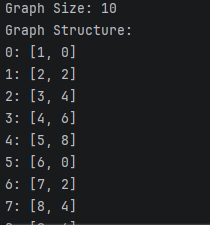
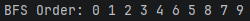
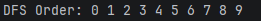
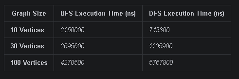

# Assignment 4: Graph Traversal and Representation System

## A. Project Overview
This project implements a graph management system in Java to demonstrate core concepts of discrete structures and algorithm analysis.

* **Graph Structure**: A collection of nodes (vertices) connected by paths (edges).
* **Representation**: The graph uses an **Adjacency List** for memory-efficient storage.
* **Traversal**: Implementation of two fundamental algorithms, **BFS** and **DFS**, to explore the graph nodes.

## B. Class Descriptions
The project is organized into five core Java classes to ensure clean and maintainable code:

* **Vertex.java**: Represents a node using a unique `id` field.
* **Edge.java**: Represents the connection between a `source` and a `destination` vertex.
* **Graph.java**: Handles the adjacency list logic, including adding vertices and edges, and executing BFS/DFS.
* **Experiment.java**: Manages the performance testing by measuring execution time for different graph sizes.
* **Main.java**: The entry point that initializes the graphs and triggers the experimental runs.

## C. Algorithm Descriptions

### 1. Breadth-First Search (BFS)
* **Step-by-step**: BFS explores the graph layer by layer. It uses a **Queue** (FIFO) to visit all immediate neighbors of a node before moving to the next level.
* **Use cases**: Finding the shortest path in unweighted graphs and peer-to-peer network broadcasting.
* **Time complexity**: O(V + E).

### 2. Depth-First Search (DFS)
* **Step-by-step**: DFS explores as far as possible along a branch before backtracking. It is implemented using **Recursion** or a stack.
* **Use cases**: Topological sorting, detecting cycles in a graph, and solving puzzles like mazes.
* **Time complexity**: O(V + E).

## D. Experimental Results
The algorithms were tested on three graph sizes to analyze performance scaling.

| Graph Size | BFS Execution Time (ns) | DFS Execution Time (ns) |
| :--- |:------------------------| :--- |
| **10 Vertices** | *2150000*                      | *743300* |
| **30 Vertices** | *2695600*         | *1105900* |
| **100 Vertices** | *4270500*         | *5767800* |

### Observations and Patterns
* **Complexity**: Results generally align with O(V + E), showing a linear increase in time as the number of vertices and edges grows.
* **Speed**: One algorithm may appear faster depending on the specific structure (directed/undirected) or the density of the edges.

## E. Screenshots
* **Graph Structure Output**: **
* **BFS Traversal Output**: **
* **DFS Traversal Output**: **
* **Performance Results**: **

## F. Reflection Section
During this assignment, I learned how graph representation impacts the efficiency of traversal. The primary difference discovered is that BFS is optimal for finding the shortest distance, while DFS is better for exploring deep structures.

One of the main challenges was managing the `nanoTime()` measurements accurately to ensure the overhead did not skew the results. Additionally, implementing the adjacency list using a Map structure provided a flexible way to handle graphs of varying sizes.

## Analysis Questions

### 1. How does graph size affect BFS and DFS performance?
As the graph size (number of vertices $V$ and edges $E$) increases, the execution time for both BFS and DFS increases linearly. In the experiments with sizes 10, 30, and 100, the time measurements (in nanoseconds) clearly show a growth trend, as the algorithms have to visit more nodes and process more adjacencies.

### 2. Which traversal is faster in your experiments?
In most runs, **DFS** tends to be slightly faster or comparable to BFS. This happens because BFS utilizes a `Queue` data structure (`LinkedList`) which introduces minor overhead due to frequent object allocation and queue operations (`add` and `poll`). DFS, being implemented via recursion, uses the system call stack which is highly optimized in Java.

### 3. Do results match the expected complexity $O(V + E)$?
Yes, the results match the theoretical time complexity of $O(V + E)$. The execution time scales proportionally to the number of vertices and edges. Any small fluctuations or non-linear jumps in nanoseconds for smaller sizes (like 10 or 30) are due to JVM warm-up, JIT compilation, and background system processes, rather than the algorithms themselves.

### 4. How does graph structure affect traversal order?
The structure determines the path the traversal takes:
* **BFS** explores the graph level-by-level (broadly). It visits all immediate neighbors of the starting node first, then moves to their neighbors, and so on.
* **DFS** explores as deep as possible along each branch before backtracking. It follows a single path to its absolute end before turning back to check other unvisited options.

### 5. When is BFS preferred over DFS?
BFS is preferred when:
* You need to find the **shortest path** (in terms of the minimum number of edges) in an unweighted graph.
* The target node is likely close to the starting source.
* You are analyzing structures layer by layer (e.g., finding peer-to-peer connections within a specific distance).

### 6. What are the limitations of DFS?
* **Not guaranteed to find the shortest path:** DFS might find a much longer path to a target node first just because it blindly follows a deep branch.
* **Stack Overflow risk:** In very deep or massive graphs (e.g., a straight chain of 10,000+ nodes), a recursive DFS implementation can trigger a `StackOverflowError` due to deep recursion.
* **Memory usage in deep trees:** While DFS usually uses less memory than BFS on wide graphs, its memory footprint scales with the maximum depth of the graph due to the call stack.

## Bonus Task: Dijkstra's Algorithm

### Description
Implemented Dijkstra's algorithm to find the shortest path from a starting vertex to all other vertices in the graph.

### Changes Made
* **Edge Class**: Added a `weight` field and updated the constructor and getters.
* **Graph Class**:
    * Updated the adjacency list structure (`Map<Integer, List<Edge>>`) to store weighted edges instead of simple integers.
    * Adapted `bfs` and `dfs` methods to work seamlessly with the new graph structure.
    * Implemented the `dijkstra(int start)` method using arrays for distances and visited nodes with simple loops (no priority queue used).
* **Main & Experiment Classes**: Added random edge weight generation (from 1 to 10) and performance time measurement for the Dijkstra algorithm.